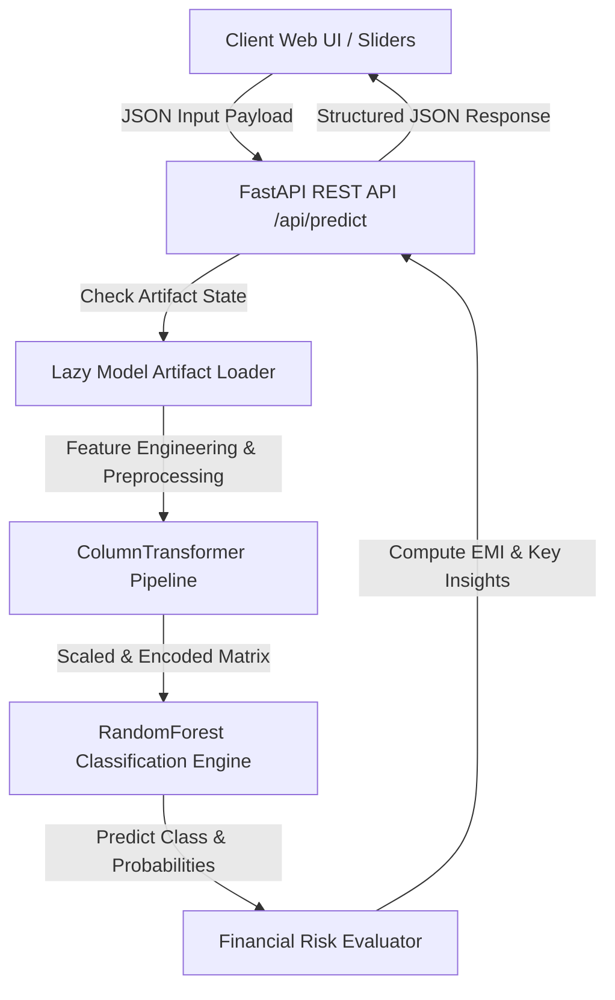

# 🏦 CreditWise — Automated Loan Eligibility & Credit Risk Intelligence Platform

<div align="center">


[](https://creditwise-loan-system-k4pp.onrender.com/)
[](https://creditwise-loan-system-k4pp.onrender.com/docs)


<p align="center">
  <b>A Full-Stack Machine Learning Web Application Powered by FastAPI</b><br>
  Predicting loan eligibility decisioning, credit risk scores, and financial repayment schedules based on applicant income, credit score, DTI ratio, collateral coverage, and employment profile.
</p>

<p align="center">
  🌐 <b>Live Web Application:</b> <a href="https://creditwise-loan-system-k4pp.onrender.com/" target="_blank">creditwise-loan-system-k4pp.onrender.com</a><br>
  📖 <b>Interactive API Docs:</b> <a href="https://creditwise-loan-system-k4pp.onrender.com/docs" target="_blank">creditwise-loan-system-k4pp.onrender.com/docs</a>
</p>

[Live Demo](https://creditwise-loan-system-k4pp.onrender.com/) •
[Key Features](#key-features) •
[Dataset Overview](#dataset-overview) •
[Architecture](#architecture) •
[ML Benchmarks](#ml-benchmarks) •
[API Specs](#api-specs) •
[Quickstart](#quickstart)

</div>

---

## 📖 Executive Summary

**CreditWise Loan System** is an end-to-end Machine Learning web application designed to evaluate applicant financial profiles and compute real-time loan approval eligibility (**Approved / Rejected**), risk ratings (**Low, Moderate, High Risk**), maximum affordable loan amounts, and complete EMI repayment schedules.

By combining exploratory data analysis, feature engineering, non-linear mathematical transformations, and an ensemble **Random Forest Classifier** with a modern **Luxury Emerald-Gold Banking Interface**, CreditWise delivers an enterprise-grade automated underwriting platform for financial institutions.

The system is deployed as a high-performance **FastAPI** backend server with lazy model artifact loading, non-caching headers, and cross-version Pydantic compatibility, accompanied by an interactive single-page web dashboard powered by **Chart.js**.

---

<a name="key-features"></a>
## ✨ Key Features

### 🤖 **1. Production Machine Learning Underwriting Engine**
- Trained on **1,000 credit applicant records** with 18 financial, demographic, and credit risk attributes.
- Built on an ensemble **Random Forest Classifier** achieving **95.79% Accuracy** and an **F1 Score of 93.55%**.
- Implements robust feature engineering including squared non-linear terms ($DTI^2$, $CreditScore^2$), total household income, loan-to-income ratio, and collateral coverage ratio.

### ⚡ **2. High-Performance FastAPI Backend**
- Asynchronous prediction endpoint (`POST /api/predict`) with strict validation via **Pydantic**.
- **Lazy Artifact Safeguard (`ensure_artifacts_loaded`)**: Automatically loads serialized model pipelines (`model_pipeline.joblib`) and datasets on demand, preventing 500 server errors.
- Built-in **NoCache HTTP Middleware** to ensure zero browser caching on dynamic API requests.
- Automatic interactive API documentation via **Swagger UI** (`/docs`) and **ReDoc** (`/redoc`).

### 🎨 **3. Luxury Emerald-Gold Banking UI System**
- Executive fintech aesthetic built with CSS design tokens, smooth backdrop elevations, dark mode elements, and responsive CSS Grid layouts.
- **Real-Time Financial Summary**: Live updates for estimated monthly EMI, total household income, debt-to-income status, and collateral coverage percentages as user adjusts range sliders.
- Instant outcome banner displaying approval probability confidence, risk level color coding, maximum recommended loan limit, and total repayment interest breakdown.

### 📊 **4. Executive Portfolio & AI Diagnostics Dashboard**
- Interactive **Chart.js** graphics:
  - 🍕 **Loan Purpose Allocation**: 68% cutout doughnut chart showing distribution across Home, Personal, Car, Business, and Education loans.
  - 📊 **Credit Score Spectrum**: Vertical gradient bar chart grouping applicants into credit risk bands.
  - 🎚️ **AI Feature Attribution Weights**: Horizontal bar chart illustrating top feature importances with human-readable financial labels.
  - 🌓 **Debt-to-Income (DTI) Leverage Segments**: Color-coded risk distribution.

### 📁 **5. Applicant Records Database Browser**
- Paginated table rendering historical applicant dataset entries with clean integer formatting (`#101`).
- Real-time client-side search across Applicant ID, employment status, employer category, and property area, combined with status and loan purpose filters.

### 🧮 **6. EMI & Financial Affordability Simulator**
- Interactive calculator with range sliders for loan amount, annual interest rate ($5.0\% - 24.0\%$), and loan tenure ($6$ to $120$ months).
- Real-time payment schedule breakdown for principal, total interest, and total repayment amount.

---

<a name="dataset-overview"></a>
## 📊 Dataset Overview & Exploratory Data Analysis

The machine learning core is built upon **`loan_approval_data.csv`**, comprising **1,000 credit applicant observations** across 19 financial, demographic, employment, and risk dimensions.

### **1. Target Variable: `Loan_Approved`**
- **Classes**: `"Yes"` (Approved) / `"No"` (Rejected)
- **Approval Rate**: $31.37\%$ Approved / $68.63\%$ Rejected
- **Encoding**: Label Encoded ($0 = \text{No}$, $1 = \text{Yes}$) for binary classification training.

### **2. Demographics & Portfolio Coverage**
- **Sample Size**: 1,000 total records (950 complete observations).
- **Average Applicant Income**: ₹10,847 / month
- **Average Loan Requested**: ₹20,456
- **Average Credit Score**: 675.1 (Fair - Good Tier)
- **Average DTI Ratio**: 0.347 (34.7%)
- **Loan Purpose Breakdown**:
  - Car Loan: 192 (20.2%)
  - Business Loan: 192 (20.2%)
  - Home Loan: 180 (18.9%)
  - Personal Loan: 169 (17.8%)
  - Education Loan: 169 (17.8%)

---

<a name="architecture"></a>
## ⚙️ Architecture & Data Flow



---

<a name="ml-benchmarks"></a>
## 🤖 Machine Learning Model Benchmarks

During model training, multiple algorithms were evaluated using stratified train/test splits. **Random Forest Classifier** achieved the highest accuracy and F1 score, demonstrating superior non-linear decision boundary modeling.

| Model Algorithm | Accuracy | Precision | Recall | F1 Score | ROC-AUC | Status |
| :--- | :---: | :---: | :---: | :---: | :---: | :---: |
| 🌲 **Random Forest Classifier** | **95.79%** | **90.62%** | **96.67%** | **93.55%** | **0.9854** | **Production Champion** |
| 📈 **Logistic Regression** | 91.05% | 87.72% | 83.33% | 85.47% | 0.9510 | Evaluated |
| 🎲 **Gaussian Naive Bayes** | 91.05% | 85.25% | 86.67% | 85.95% | 0.9664 | Evaluated |

### 🔍 Top Predictor Feature Importances
1. **Debt-to-Income (DTI) Ratio** (~19.3% Weight)
2. **Credit Score Scale** (~18.4% Weight)
3. **DTI Non-Linear Risk Curve** (~16.4% Weight)
4. **Credit Score Metric** (~15.7% Weight)
5. **Applicant Income** (~4.9% Weight)
6. **Loan-to-Income Ratio** (~4.8% Weight)

---

<a name="api-specs"></a>
## 📖 API Documentation & Specifications

### Primary Endpoints Overview

| Method | Endpoint | Description |
| :--- | :--- | :--- |
| `GET` | `/` | Serves the single-page application UI (`static/index.html`) |
| `POST` | `/api/predict` | Runs ML model evaluation, risk assessment, and EMI calculations |
| `GET` | `/api/stats` | Fetches portfolio summary stats, model accuracy, and chart binning data |
| `GET` | `/api/applicants` | Fetches paginated dataset records with filtering and search |

### `POST /api/predict` Request & Response Specification

#### Sample Request Payload
```json
{
  "Applicant_Income": 85000.0,
  "Coapplicant_Income": 25000.0,
  "Age": 35.0,
  "Dependents": 1.0,
  "Credit_Score": 720.0,
  "Existing_Loans": 1.0,
  "DTI_Ratio": 0.28,
  "Savings": 150000.0,
  "Collateral_Value": 750000.0,
  "Loan_Amount": 500000.0,
  "Loan_Term": 36.0,
  "Employment_Status": "Salaried",
  "Marital_Status": "Married",
  "Loan_Purpose": "Personal",
  "Property_Area": "Urban",
  "Education_Level": "Graduate",
  "Gender": "Male",
  "Employer_Category": "Private"
}
```

#### Sample JSON Response
```json
{
  "decision": "Approved",
  "approval_probability": 70.5,
  "rejection_probability": 29.5,
  "risk_level": "Moderate Risk",
  "risk_color": "#F59E0B",
  "financial_summary": {
    "requested_loan_amount": 500000.0,
    "loan_term_months": 36,
    "estimated_emi": 16251.23,
    "total_payment": 585044.28,
    "total_interest": 85044.28,
    "max_loan_recommended": 1095617.9,
    "collateral_coverage_pct": 150.0,
    "loan_to_annual_income_ratio": 0.38
  },
  "key_insights": [
    { "type": "positive", "text": "Strong Credit Score (720) significantly boosts eligibility." },
    { "type": "positive", "text": "Healthy Debt-to-Income Ratio (28.0%)." },
    { "type": "positive", "text": "Excellent collateral coverage (150.0% of loan amount)." }
  ],
  "model_used": "RandomForest"
}
```

---

<a name="quickstart"></a>
## 🛠️ Quickstart & Local Setup Guide

### 1. Clone the Repository
```bash
git clone https://github.com/PIYUSH01092004/creditwise-loan-system.git
cd creditwise-loan-system
```

### 2. Set Up Virtual Environment
```bash
# Windows
python -m venv venv
venv\Scripts\activate

# macOS / Linux
python3 -m venv venv
source venv/bin/activate
```

### 3. Install Dependencies
```bash
pip install -r requirements.txt
```

### 4. Train & Export Pipeline Artifacts (Optional)
```bash
python train_model.py
```

### 5. Launch FastAPI Application Server
```bash
python -m uvicorn main:app --host 127.0.0.1 --port 8000 --reload
```
Open your web browser and visit: **`http://127.0.0.1:8000`**

---

## 📂 Repository File Structure

```text
Creditwise_Loan_System/
├── main.py                  # FastAPI Application Server & REST Routes
├── train_model.py           # ML Model Training & Pipeline Export Script
├── model_pipeline.joblib    # Serialized Scikit-Learn Model Artifact
├── loan_approval_data.csv   # Credit Applicant Dataset (1,000 rows)
├── Credit_wise.ipynb        # Jupyter Notebook with EDA & Model Development
├── requirements.txt         # Project Dependencies
├── README.md                # Project Documentation
├── .gitignore               # Git Ignore Rules
└── static/
    ├── index.html           # Single Page Dashboard Markup
    ├── css/
    │   └── styles.css       # Luxury Emerald-Gold Design System Stylesheet
    └── js/
        └── app.js           # Client-Side Application Logic & Chart.js Visuals
```

---

## 👤 Author

Developed by **[Piyush Gupta](https://github.com/PIYUSH01092004)**

---

## 📜 License

This project is licensed under the **MIT License**. See `LICENSE` for details.
