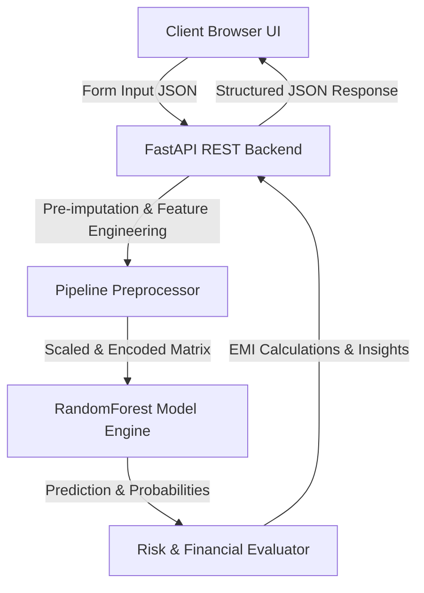

<div align="center">

# 🏦 CreditWise Intelligence Platform
### *Enterprise AI-Powered Automated Credit Risk Assessment & Underwriting Platform for SecureTrust Bank*

[](https://fastapi.tiangolo.com/)
[](https://www.python.org/)
[](https://scikit-learn.org/)
[](https://www.chartjs.org/)
[](LICENSE)
[](#-machine-learning-performance--benchmarks)

</div>

---

## 📌 Executive Summary

**CreditWise Intelligence Platform** is a full-stack Machine Learning application developed for automated credit underwriting, financial risk evaluation, and loan eligibility scoring. 

The system leverages a trained **Random Forest Classification Engine** trained on applicant financial profiles to compute real-time credit decisioning (**Approved / Rejected**), risk classifications (**Low, Moderate, High Risk**), maximum recommended loan limits, and complete EMI repayment schedules.

Designed with a modern **Luxury Emerald & Gold Fintech UI System**, the platform delivers an intuitive single-page banking dashboard powered by **FastAPI** and **Chart.js**.

---

## 🌟 Key Features & Functional Modules

### 🎛️ 1. Automated Credit Risk Evaluator
- **Real-Time ML Underwriting**: Inputs monthly income, credit score, DTI ratio, collateral value, active loans, and employment details to compute instant approval probabilities.
- **Dynamic Risk Categorization**: Classifies applications into **Low Risk** (Emerald), **Moderate Risk** (Amber), or **High Risk** (Crimson) based on probability confidence and credit thresholds.
- **AI Model Risk Insights**: Generates automated positive and negative risk factors explaining the model's decisioning (e.g., *"Healthy Debt-to-Income Ratio (28.0%)"*, *"Excellent collateral coverage (175.0%)"*).
- **Auto-Fill Demonstration**: Built-in sample data generator for instant interactive testing.

### 📊 2. Executive Analytics & Portfolio Diagnostics
- **Interactive Chart.js Visuals**:
  - 🍕 **Loan Purpose Allocation**: Custom doughnut chart visualizing portfolio distribution across Home, Personal, Car, Business, and Education loans.
  - 📊 **Credit Score Spectrum**: Vertical gradient bar chart grouping applicants into credit risk bands.
  - 🎚️ **AI Feature Attribution Weights**: Horizontal bar chart illustrating top feature importances impacting approval decisions.
  - 🌓 **Debt-to-Income (DTI) Leverage Segments**: Risk distribution based on applicant debt obligations.
- **Executive KPI Cards**: Real-time trackers for total applications, approval rates, baseline credit averages, and production model accuracy.

### 📁 3. Applicant Records Database Browser
- **Data Table Engine**: Paginated table rendering historical applicant records with column sorting and status badge indicators.
- **Filtering & Multi-Field Search**: Real-time client-side search across Applicant ID, employment status, employer category, and property area, combined with loan purpose and approval status filters.

### 🧮 4. Interactive EMI & Financial Simulator
- **Repayment Calculator**: Interactive slider controls for loan principal, annual interest rate (5.0% - 24.0%), and tenure (6 to 120 months).
- **Payment Schedule Breakdown**: Real-time calculation of estimated monthly EMI, total finance interest, and cumulative repayment totals.

---

## 🤖 Machine Learning Performance & Benchmarks

During model development, multiple classification algorithms were evaluated on stratified train/test splits. The **Random Forest Classifier** achieved superior performance across all evaluation metrics and was selected as the production inference engine.

| Model Algorithm | Accuracy | Precision | Recall | F1 Score | ROC-AUC | Status |
| :--- | :---: | :---: | :---: | :---: | :---: | :---: |
| 🌲 **Random Forest Classifier** | **95.79%** | **90.62%** | **96.67%** | **93.55%** | **0.9854** | **Production Champion** |
| 📈 **Logistic Regression** | 89.47% | 84.48% | 81.67% | 83.05% | 0.9508 | Evaluated |
| 🎲 **Gaussian Naive Bayes** | 90.53% | 82.81% | 88.33% | 85.48% | 0.9667 | Evaluated |

### 🔍 Top Feature Importances
The Random Forest model identifies the following top predictors for loan eligibility:
1. **Debt-to-Income (DTI) Ratio** (~19.3% Weight)
2. **Credit Score Scale** (~18.4% Weight)
3. **DTI Non-Linear Risk Curve** (~16.4% Weight)
4. **Credit Score Metric** (~15.7% Weight)
5. **Applicant Monthly Income** (~4.9% Weight)
6. **Loan-to-Income Ratio** (~4.8% Weight)

---

## ⚙️ System Architecture & Data Flow



---

## 🛠️ Technology Stack & Dependencies

- **Backend**: Python 3.9+, FastAPI, Uvicorn, Pydantic v2, Starlette
- **Machine Learning & Analytics**: Scikit-Learn, Pandas, NumPy, Joblib
- **Frontend & Design System**: HTML5, Vanilla CSS3 (Custom Design System with Glassmorphism), ES6 JavaScript, Chart.js
- **Typography & Assets**: Google Fonts (*Outfit*, *JetBrains Mono*), FontAwesome 6 Icons

---

## 🚀 Quickstart & Installation

### 1. Clone the Repository
```bash
git clone https://github.com/PIYUSH01092004/creditwise-loan-system.git
cd creditwise-loan-system
```

### 2. Create & Activate Virtual Environment (Optional but Recommended)
```bash
# Windows
python -m venv venv
venv\Scripts\activate

# macOS / Linux
python3 -m venv venv
source venv/bin/activate
```

### 3. Install Dependencies
```bash
pip install -r requirements.txt
```

### 4. Train the ML Pipeline (Optional)
To retrain the ML models from `loan_approval_data.csv` and generate `model_pipeline.joblib`:
```bash
python train_model.py
```

### 5. Start the Application Server
```bash
python -m uvicorn main:app --host 127.0.0.1 --port 8000 --reload
```
Open your browser and navigate to: **`http://127.0.0.1:8000`**

---

## 📖 API Documentation & Schema

### `POST /api/predict`
Calculates loan decisioning, risk rating, and financial summary.

#### Request Body Example
```json
{
  "Applicant_Income": 85000.0,
  "Coapplicant_Income": 25000.0,
  "Age": 35.0,
  "Dependents": 1.0,
  "Credit_Score": 720.0,
  "Existing_Loans": 1.0,
  "DTI_Ratio": 0.28,
  "Savings": 150000.0,
  "Collateral_Value": 750000.0,
  "Loan_Amount": 500000.0,
  "Loan_Term": 36.0,
  "Employment_Status": "Salaried",
  "Marital_Status": "Married",
  "Loan_Purpose": "Personal",
  "Property_Area": "Urban",
  "Education_Level": "Graduate",
  "Gender": "Male",
  "Employer_Category": "Private"
}
```

#### Response Example
```json
{
  "decision": "Approved",
  "approval_probability": 70.5,
  "rejection_probability": 29.5,
  "risk_level": "Moderate Risk",
  "risk_color": "#F59E0B",
  "financial_summary": {
    "requested_loan_amount": 500000.0,
    "loan_term_months": 36,
    "estimated_emi": 16251.23,
    "total_payment": 585044.28,
    "total_interest": 85044.28,
    "max_loan_recommended": 1095617.9,
    "collateral_coverage_pct": 150.0,
    "loan_to_annual_income_ratio": 0.38
  },
  "key_insights": [
    { "type": "positive", "text": "Strong Credit Score (720) significantly boosts eligibility." },
    { "type": "positive", "text": "Healthy Debt-to-Income Ratio (28.0%)." }
  ],
  "model_used": "RandomForest"
}
```

---

## 📂 Repository File Structure

```text
Creditwise_Loan_System/
├── main.py                  # FastAPI Application & REST API Endpoints
├── train_model.py           # ML Model Training & Pipeline Serialization
├── model_pipeline.joblib    # Serialized Scikit-Learn Model Artifact
├── loan_approval_data.csv   # Credit Applicant Dataset (1,000 records)
├── Credit_wise.ipynb        # Jupyter Notebook with EDA & Model Development
├── requirements.txt         # Dependencies manifest
├── README.md                # Project documentation
├── .gitignore               # Repository ignore rules
└── static/
    ├── index.html           # Dashboard UI Application Markup
    ├── css/
    │   └── styles.css       # Custom Design System Stylesheet
    └── js/
        └── app.js           # Client UI Logic & Chart.js Integration
```

---

## 👤 Author

Developed by **[Piyush Gupta](https://github.com/PIYUSH01092004)**

---

## 📜 License

This project is licensed under the [MIT License](LICENSE).
